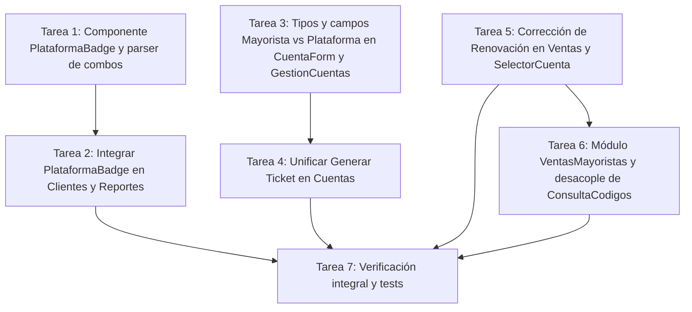

# Propuesta SDD: Mejoras de Flujos y Ventas Mayoristas

**Identificador:** `mejoras-flujos-y-ventas-mayoristas`  
**Rama:** `feature/mejoras-flujos-y-ventas-mayoristas`  
**Estado:** Propuesta lista para revisión  
**Fecha:** 2026-08-30  

---

## 1. Resumen Ejecutivo

Esta propuesta aborda 5 mejoras críticas en la experiencia de usuario y arquitectura de frontend de StreamControl:
1. **Componente de Badges de Plataformas (`PlataformaBadge.tsx`)** con soporte inteligente para ventas combinadas (combos multi-servicio) sin rotura de layouts.
2. **Corrección del Flujo de Renovación de Clientes** asegurando la preselección de cuenta y perfil asignado previo (`initialCuentaId`, `initialPerfil`) en `SelectorCuenta`.
3. **Estandarización de Tickets**: Unificación de la plantilla de tickets entre Cuentas y Clientes, renombrado de "Copiar datos" a "Generar ticket", con política estricta de NO simular ni inventar datos ausentes.
4. **Clarificación Conceptual: Plataforma vs Mayorista**: Renombrado de "Proveedor" a "Plataforma / Servicio", y adición del campo opcional "Nombre del Proveedor (Mayorista)" (`nombreProveedor`) en tipos, formularios y listados.
5. **Módulo Dedicado de Ventas Mayoristas (`/mayoristas`)**: Extracción de los flujos de generación y consulta de links para revendedores/sub-distribuidores fuera de `ConsultaCodigos.tsx`, estructurando una vista con pestañas "Nueva Venta Mayorista" y "Ventas Mayoristas Activas", acompañada de su botón de acción principal.

---

## 2. Especificación Técnica por Componente

### 2.1 Visualización de Plataformas (`PlataformaBadge.tsx`)
- **Diseño del Componente:**
  - Componente: `src/components/PlataformaBadge.tsx`.
  - Recibe `plataforma: string`, `size?: 'sm' | 'md' | 'lg'`, `showIcon?: boolean`.
  - Función auxiliar `parsePlataformas(str: string): string[]` que divide cadenas con delimitadores `+` o `,` eliminando espacios superfluos.
  - Paleta de marcas soportadas:
    - **Netflix:** `bg-red-50 text-red-600 border-red-200`
    - **Disney+ / Disney premium:** `bg-blue-50 text-blue-600 border-blue-200`
    - **Max / HBO Max:** `bg-purple-50 text-purple-600 border-purple-200`
    - **Prime Video:** `bg-sky-50 text-sky-600 border-sky-200`
    - **Spotify / Spotify Premium:** `bg-emerald-50 text-emerald-600 border-emerald-200`
    - **Crunchyroll:** `bg-orange-50 text-orange-600 border-orange-200`
    - **ChatGPT:** `bg-teal-50 text-teal-600 border-teal-200`
    - **MagisTV / IPTV:** `bg-indigo-50 text-indigo-600 border-indigo-200`
    - **Win Sports+:** `bg-amber-50 text-amber-600 border-amber-200`
    - **Canva Premium:** `bg-rose-50 text-rose-600 border-rose-200`
    - **Default / Otro:** `bg-slate-100 text-slate-700 border-slate-200`
- **Integración:**
  - `src/pages/GestionClientes.tsx`: En la columna "Plataforma" de la tabla y en el modal de Historial.
  - `src/pages/Reportes.tsx`: En la columna "Plataforma" de la tabla de ventas.

### 2.2 Flujo de Renovación de Clientes
- **Propagación de Estado:**
  - `GestionClientes.tsx`: `navigate('/ventas', { state: { cliente: c } })` ya envía el objeto `Cliente` con `cuentaId` y `perfilAsignado`.
  - `Ventas.tsx`: Extrae `cliente.cuentaId` y `cliente.perfilAsignado` (o fallback a `lastVenta.cuentaId` / `lastVenta.perfilNombre`) y los asigna a `data.cuentaId` y `data.perfilNombre`.
  - `VentasForm.tsx`: Recibe `initialData.cuentaId` e `initialData.perfilNombre` e inicializa sus estados internos `cuentaId` y `perfilAsignado`, pasándolos como props `initialCuentaId` e `initialPerfil` a `<SelectorCuenta />`.
- **Selector Inteligente (`SelectorCuenta.tsx`):**
  - En `cuentasDisponibles`: Incluir cuentas donde `c.id === initialCuentaId` independientemente de si su estado es `'asignada'`.
  - En `perfilesDisponibles`: Incluir perfiles donde `p.nombre === initialPerfil` (o `p.clienteNombre === cliente.nombre`) aun cuando `p.estado === 'asignado'`.
  - Renderizar `(Asignado actualmente)` o `(Actual)` junto al perfil correspondiente para dar claridad al vendedor.

### 2.3 Generación de Tickets Unificada
- **Cuentas (`GestionCuentas.tsx`):**
  - Renombrar opción en DropdownMenu: "Copiar datos" -> **"Generar ticket"** con icono `Ticket` o `Copy`.
  - Renombrar título del modal: **"Ticket de la Cuenta"**.
  - Plantilla estándar de salida:
    ```
    📋 *Datos de la Cuenta - {proveedor}*
    📧 Correo: {correoCuenta}
    🔑 Contraseña: {contrasena}
    {if perfiles.length > 0}
    👤 Perfiles:
      - {perfil.nombre}{perfil.pin ? ` (PIN: ${perfil.pin})` : ''}
    {if fechaVencimiento}
    ⏳ Vencimiento: {fechaVencimiento} ({diasRestantes} días)
    ━━━━━━━━━━━━━━━━━━━━━━
    Generado por StreamControl
    ```
  - **Regla Estricta:** Si no hay contraseña, no se renderiza la línea `🔑 Contraseña`. Si no hay PIN, no se agrega `(PIN: ...)`. Si la cuenta es completa (sin perfiles), no se inventa lista de perfiles ficticios.

### 2.4 Plataforma vs Proveedor Mayorista
- **Tipos (`src/types/cuenta.ts`):**
  - Agregar campo opcional: `nombreProveedor?: string;`
- **Formulario (`src/components/CuentaForm.tsx`):**
  - Renombrar campo: "Proveedor *" -> **"Plataforma / Servicio *"**
  - Agregar campo opcional: **"Nombre del Proveedor (Mayorista)"** con placeholder: *"Ej: Pedro Cuentas, Distribuidor XYZ (opcional)"*.
- **Vistas (`GestionCuentas.tsx`, `CuentaDetail.tsx`):**
  - Mostrar el nombre del mayorista como dato secundario o badge tenue debajo de la plataforma en la tabla de cuentas y en la vista de detalle.

### 2.5 Módulo de Ventas Mayoristas (`/mayoristas`)
- **Nueva Página (`src/pages/VentasMayoristas.tsx`):**
  - Encabezado con título "Ventas Mayoristas", descripción y botón destacado **"Registrar Venta Mayorista"**.
  - Pestañas principales:
    - **Pestaña 1: "Nueva Venta Mayorista"**
      - Selector de cuenta (con cuentas que tengan perfiles disponibles).
      - Multi-selector de perfiles con casillas de verificación (batch selection / seleccionar todos).
      - Datos del revendedor (Nombre del sub-distribuidor, Total recibido $, Costo total calculado, Utilidad proyectada).
      - Selector de duración (7, 15, 30, 60 días o personalizado).
      - Generador de Link con previsualización inmediata y botón de copiado.
    - **Pestaña 2: "Ventas Mayoristas Activas"**
      - Listado de links/tokens para sub-distribuidores.
      - Métricas rápidas: Total links, Activos, Vencidos.
      - Acciones: Copiar enlace, Revocar token, Reactivar token.
- **Rutas (`src/App.tsx`):**
  - Registrar `/mayoristas` y redirección de `/revendedores` hacia `/mayoristas`.
- **Navegación (`src/components/Layout.tsx`):**
  - Agregar ítem en menú lateral con ícono `Users` o `UserPlus` titulado **"Mayoristas"** (para roles `admin` y `usuario`).
- **Limpieza de `ConsultaCodigos.tsx`:**
  - Mantener exclusivamente la interfaz de consulta directa de códigos IMAP por proveedor.
  - Eliminar las pestañas duplicadas de generación de links mayoristas.

---

## 3. Grafo Acíclico Dirigido (DAG) de Tareas



### Detalle de Tareas:

1. **Tarea 1 (Infraestructura Visual):** Crear `src/components/PlataformaBadge.tsx` con estilos por plataforma y split de combos.
2. **Tarea 2 (Integración Visual):** Sustituir badges de texto plano en `src/pages/GestionClientes.tsx` y `src/pages/Reportes.tsx`.
3. **Tarea 3 (Cuentas y Mayoristas):** Modificar `src/types/cuenta.ts`, `CuentaForm.tsx`, `GestionCuentas.tsx` y `CuentaDetail.tsx` para incorporar `nombreProveedor` y renombrar a "Plataforma / Servicio".
4. **Tarea 4 (Tickets Unificados):** Actualizar `GestionCuentas.tsx` para renombrar a "Generar ticket", formatear con la plantilla estándar y asegurar la omisión estricta de campos vacíos.
5. **Tarea 5 (Fix Renovación):** Actualizar `Ventas.tsx`, `VentasForm.tsx` y `SelectorCuenta.tsx` para retener y permitir seleccionar la cuenta/perfil previamente asignados en renovaciones.
6. **Tarea 6 (Módulo Mayoristas):** Crear `src/pages/VentasMayoristas.tsx`, limpiar `src/pages/ConsultaCodigos.tsx`, añadir ruta en `src/App.tsx` y enlace en `src/components/Layout.tsx`.
7. **Tarea 7 (Verificación):** Comprobar consistencia de tipos TypeScript y validar suite de tests.

---

## 4. Criterios de Aceptación

- [ ] Todas las plataformas reconocidas muestran su color característico y los combos aparecen divididos limpiamente en badges individuales.
- [ ] Al hacer clic en "Renovar" en un cliente con cuenta y perfil asignados, el formulario de venta carga la cuenta y el perfil actual como seleccionados.
- [ ] En "Gestión de Cuentas", la acción se titula "Generar ticket" y genera un ticket uniforme sin datos inventados.
- [ ] En "Registrar Cuenta", el primer campo es "Plataforma / Servicio" y existe el campo opcional "Nombre del Proveedor (Mayorista)".
- [ ] La ruta `/mayoristas` está disponible en el menú lateral y permite registrar ventas mayoristas y gestionar links activos de forma aislada a la consulta de códigos.
