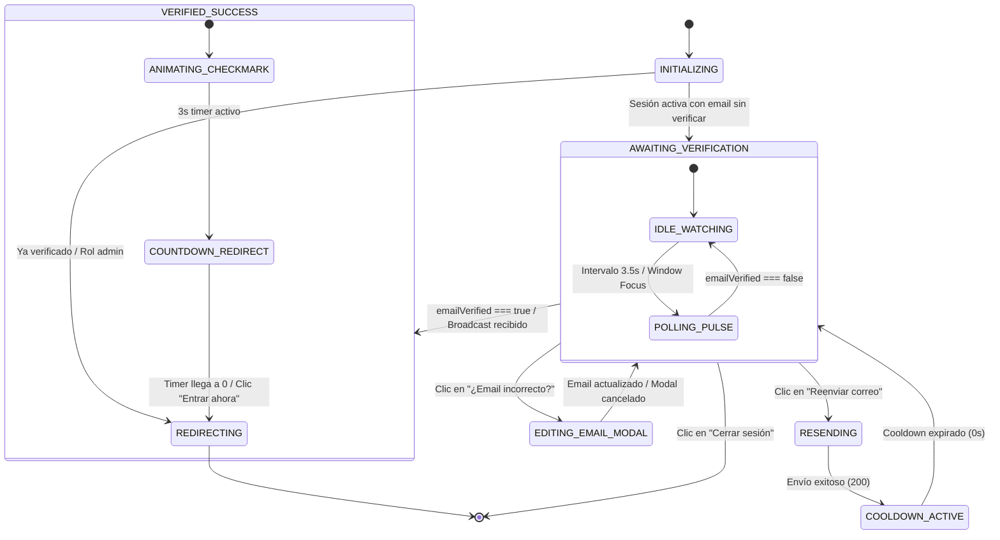

# Especificaciones: Onboarding Reactivo y Verificación de Correo en Tiempo Real

**Identificador:** `registro-verificacion-reactiva`  
**Fecha:** 2026-08-30  
**Autor:** Senior Architect  
**Estado:** Especificación aprobada  

---

## 1. Requerimientos Funcionales

### REQ-001: Detección Reactiva en Background (Smart Polling + Focus Triggers)
- **Descripción:** El sistema debe comprobar de forma continua y no intrusiva si el usuario autenticado actual ha verificado su correo electrónico.
- **Detalle Técnico:**
  - Iniciar un intervalo de sondeo cada 3.500 ms invocando `auth.currentUser.reload()`.
  - Escuchar eventos `window.addEventListener('focus')` y `document.addEventListener('visibilitychange')` para ejecutar una comprobación inmediata con *debounce* de 500 ms al volver a la pestaña.
  - Al detectar `auth.currentUser.emailVerified === true`, actualizar el estado global en `AuthContext` y transicionar a estado verificado.
  - Limpiar (*cleanup*) todos los temporizadores y listeners al desmontar el componente para evitar memory leaks.

### REQ-002: Sincronización Multi-Pestaña e Inter-Dispositivos
- **Descripción:** Si el usuario verifica su cuenta en otra pestaña del mismo navegador o en un dispositivo móvil externo, la sesión activa en el navegador debe enterarse y responder de inmediato.
- **Detalle Técnico:**
  - Instanciar un `BroadcastChannel('streamcontrol_auth_sync')`.
  - Cuando `/r/verificar-email` o cualquier pestaña confirme la verificación exitosa, emitir un mensaje `{ type: 'EMAIL_VERIFIED', uid: user.uid }`.
  - La pestaña de `VerificarEmail.tsx` debe recibir el mensaje y transicionar inmediatamente a estado de éxito.

### REQ-003: Temporizador de Cooldown Persistido y Manejo de Rate Limit
- **Descripción:** El botón de reenvío de correo debe respetar estrictamente la ventana de rate limit de 60 segundos impuesta por el backend, ofreciendo retroalimentación visual continua.
- **Detalle Técnico:**
  - Al cargar la pantalla o al hacer clic en "Reenviar correo", calcular el timestamp `cooldownUntil = Date.now() + 60_000` y persistirlo en `sessionStorage.setItem('sc_email_cooldown_until', cooldownUntil)`.
  - Si el usuario refresca la página, recuperar `cooldownUntil` de `sessionStorage`. Si `cooldownUntil > Date.now()`, reanudar el contador regresivo desde los segundos restantes.
  - Mientras el contador sea mayor a 0, el botón permanecerá deshabilitado con la etiqueta `Reenviar correo (XXs)`.
  - Al llegar a 0, habilitar el botón con la etiqueta `Reenviar correo`.

### REQ-004: Vías de Escape (Corrección de Email y Cierre de Sesión)
- **Descripción:** Evitar el bloqueo del usuario permitiéndole corregir su correo electrónico si cometió un error tipográfico, o cerrar su sesión para ingresar con otra cuenta.
- **Detalle Técnico:**
  - Proveer un modal accesible "*Cambiar dirección de correo*" que solicite el nuevo email y la contraseña actual.
  - Ejecutar `updateUserEmail(newEmail, password)`, actualizar el estado en `AuthContext` y disparar un nuevo envío de verificación a la nueva casilla.
  - Proveer un botón/enlace secundario "*Cerrar sesión*" que invoque `logout()` y redirija a `/login`.

### REQ-005: Micro-interacciones y Animación de Radar con Framer Motion
- **Descripción:** La interfaz debe comunicar visualmente que StreamControl está sondeando activamente el estado de verificación.
- **Detalle Técnico:**
  - Renderizar 3 anillos concéntricos con `framer-motion` que se expandan escalonadamente de escala `1` a `2.2` con `opacity` decreciente de `0.6` a `0`.
  - Incluir un pulso central con icono de correo y brillo ambiental índigo/violeta.
  - Respetar preferencias de accesibilidad `prefers-reduced-motion`.

### REQ-006: Transición Animada de Éxito y Redirección Automática
- **Descripción:** Al completarse la verificación, la UI debe transformarse de forma gratificante y conducir al usuario automáticamente al Dashboard.
- **Detalle Técnico:**
  - Transición fluida con `framer-motion` del radar a un icono de checkmark verde esmeralda con trazado vectorial animado.
  - Cuenta regresiva de redirección de 3 segundos ("*Entrando al panel en 3...*").
  - Botón de escape "*Entrar ahora*" para omisión inmediata del temporizador.
  - Navegación a `/` mediante `navigate('/', { replace: true })`.

### REQ-007: Resiliencia ante Fallos de Red y Tolerancia Offline
- **Descripción:** Si el usuario pierde la conexión a internet temporalmente durante el sondeo, la aplicación no debe crashear ni mostrar errores intrusivos.
- **Detalle Técnico:**
  - Capturar silenciosamente los errores de red en `auth.currentUser.reload()`.
  - Reanudar el ciclo de sondeo una vez que el evento `window.addEventListener('online')` se dispare.

---

## 2. Máquina de Estados (State Machine)

### Diagrama de Estados en Mermaid



---

## 3. Criterios de Aceptación (Gherkin Scenarios)

### Escenario 1: Detección automática tras validar en otra pestaña o móvil
```gherkin
Given un usuario autenticado con email "vendedor@test.com" en la pantalla /verificar-email
When el usuario abre el enlace de verificación en su móvil y confirma su token
Then en un lapso máximo de 3.5 segundos o al enfocar la pestaña del navegador
And la pantalla de StreamControl transiciona automáticamente a VERIFIED_SUCCESS sin requerir clics manuales
And tras 3 segundos o al pulsar "Entrar ahora", el usuario es redirigido al Dashboard "/"
```

### Escenario 2: Cooldown de 60 segundos y persistencia ante recarga
```gherkin
Given un usuario en la pantalla /verificar-email que presiona "Reenviar correo"
When la Cloud Function responde exitosamente
Then el botón cambia a estado deshabilitado con texto "Reenviar correo (60s)"
And el contador decrementa segundo a segundo
When el usuario recarga la página en el segundo 42
Then el botón continúa deshabilitado mostrando "Reenviar correo (42s)" hasta llegar a 0s
```

### Escenario 3: Corrección de correo mal escrito (Escape Hatch)
```gherkin
Given un usuario que ingresó "ana@gamil.com" por error
When hace clic en "¿Te equivocaste de correo? Cambialo acá"
Then se despliega un modal solicitando el nuevo correo "ana@gmail.com" y su contraseña
When confirma el formulario
Then se actualiza la cuenta en Firebase Auth y Firestore
And se dispara automáticamente el nuevo correo de verificación a "ana@gmail.com"
And la pantalla principal refleja la nueva dirección actualizada
```

### Escenario 4: Cierre de sesión seguro
```gherkin
Given un usuario en la pantalla de verificación
When hace clic en "Cerrar sesión / Volver al login"
Then se ejecuta AuthContext.logout()
And el usuario es redirigido limpiamente a "/login" sin inconsistencias de estado
```

---

## 4. Matriz de Casos de Borde (*Edge Cases*)

| Caso de Borde | Comportamiento Esperado | Mitigación Técnica |
|---|---|---|
| **Corte momentáneo de conexión a Internet** | El polling no debe arrojar toasts de error molestos. Al volver internet, el sondeo continúa normalmente. | Envolver `auth.currentUser.reload()` en bloque `try/catch` silencioso; escuchar evento `online`. |
| **Token expirado o alterado desde link externo** | `VerificarEmailLink.tsx` muestra error claro con botón directo para reabrir `/app/verificar-email` y solicitar uno nuevo. | Manejo explícito de códigos de error de API (`deadline-exceeded`, `not-found`). |
| **Múltiples pestañas abiertas en la misma máquina** | Todas las pestañas abiertas deben enterarse simultáneamente sin conflicto de estado. | Sincronización vía `BroadcastChannel('streamcontrol_auth_sync')`. |
| **Nuevo correo ya en uso al corregir email** | El modal muestra toast de error `Este correo ya está registrado` sin cerrar el diálogo ni romper el estado. | Captura del código `auth/email-already-in-use` en `updateUserEmail`. |
| **Admin o usuario ya verificado navega a `/verificar-email`** | Redirección inmediata a `/` sin renderizar el formulario. | Guardian de estado: `if (user.emailVerified || user.rol === 'admin') return <Navigate to="/" replace />;`. |
