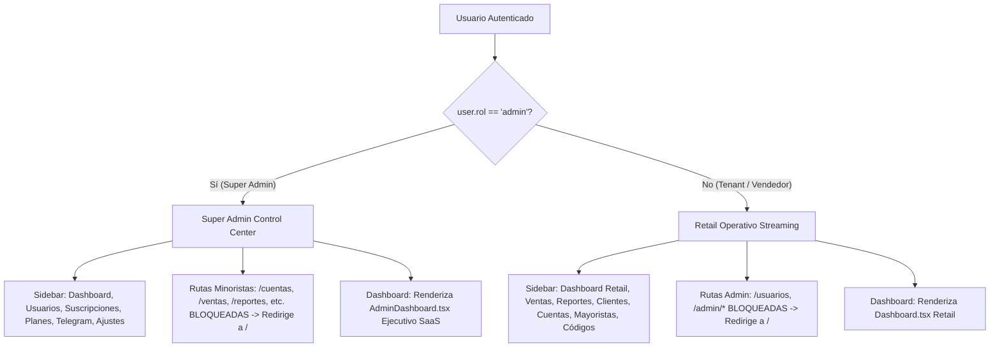
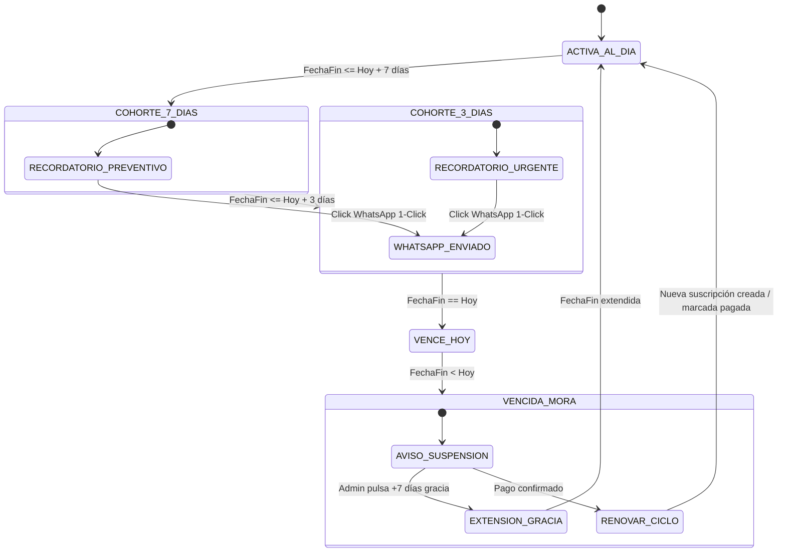

# Especificaciones Técnicas: Super Admin Control Center 2.0

**Identificador:** `super-admin-control-center`  
**Fecha:** 2026-08-31  
**Autor:** Senior Architect  
**Estado:** Especificación aprobada para SDD  

---

## 1. Requerimientos Funcionales

### REQ-001: Aislamiento Estricto de Rutas y Navegación por Rol
- **Descripción:** El sistema debe aislar de forma absoluta el entorno del Super Administrador (`rol: 'admin'`) respecto a los módulos de operación minorista de streaming.
- **Detalle Técnico:**
  - En `src/components/Layout.tsx`, cuando `user?.rol === 'admin'`, la barra de navegación lateral (`navItems`) debe contener únicamente:
    1. `Dashboard` (`/`)
    2. `Usuarios` (`/usuarios`)
    3. `Suscripciones` (`/admin/suscripciones`)
    4. `Planes` (`/admin/planes`)
    5. `Telegram` (`/telegram`)
    6. `Ajustes` (`/ajustes`)
  - Se eliminan del sidebar del admin: `/cuentas`, `/mayoristas`, `/consulta-codigos`, `/ventas`, `/reportes`, `/gestion-clientes`.
  - En `src/App.tsx`, las rutas minoristas (`/cuentas`, `/mayoristas`, `/consulta-codigos`, `/ventas`, `/reportes`, `/gestion-clientes`) deben configurarse con `<PrivateRoute roles={['usuario']}>`.
  - Si un administrador autenticado navega directamente a una ruta minorista restringida, `PrivateRoute` debe redirigirlo automáticamente a `/` (`Navigate to="/" replace`).

### REQ-002: Motor Financiero y Métricas SaaS en Tiempo Real (MRR, ARR, ARPU)
- **Descripción:** El panel de administración debe calcular y presentar dinámicamente las métricas clave de salud del negocio SaaS a partir de la colección `suscripciones` de Firestore.
- **Fórmulas de Cálculo:**
  - **Suscripciones Activas Pagadas ($S_{act}$):** Suscripciones con `estado === 'activa'` y `pagoEstado === 'pagado'`.
  - **MRR (Monthly Recurring Revenue):**
    $$\text{MRR} = \sum_{s \in S_{act}} \text{NormalizarAMes}(s.\text{monto}, s.\text{planNombre})$$
    *Donde la normalización considera:*
    - Mensual (o base): $\text{monto}$.
    - Trimestral: $\text{monto} / 3$.
    - Semestral: $\text{monto} / 6$.
    - Anual: $\text{monto} / 12$.
    *(Si no se especifica periodicidad, se toma `monto` como base mensual de ciclo activo).*
  - **ARR (Annual Run Rate):**
    $$\text{ARR} = \text{MRR} \times 12$$
  - **Tenants Activos:** Conteo único de `usuarioId` con al menos 1 suscripción activa pagada.
  - **ARPU (Average Revenue Per User):**
    $$\text{ARPU} = \frac{\text{MRR}}{\text{Tenants Activos}} \quad (\text{o 0 si no hay activos})$$
  - **Tasa de Cobro / Mora:** Conteo de suscripciones activas con `pagoEstado === 'pendiente'` o `pagoEstado === 'vencido'`.

### REQ-003: Visualizaciones Recharts Dark SaaS
- **Descripción:** Representación gráfica interactiva adaptada al estándar Dark SaaS (`slate-950` canvas, contrastes WCAG AA).
- **Gráficos Requeridos:**
  1. **Evolución Mensual de Ingresos (AreaChart / BarChart):**
     - Eje X: Últimos 6 meses (`MMM YYYY`).
     - Eje Y: Monto facturado acumulado en la moneda configurada.
     - Gradiente: `from-indigo-500/80 to-indigo-500/10` con línea `stroke="#6366f1"`.
     - Tooltip oscuro personalizado con formato monetario.
  2. **Distribución de Suscriptores por Plan (Donut Chart - PieChart):**
     - Distribución porcentual de planes activos (Starter, Professional, Enterprise, Otros).
     - Paleta Neón: `#6366F1` (Índigo), `#38BDF8` (Cian), `#A855F7` (Púrpura), `#34D399` (Esmeralda), `#F59E0B` (Ámbar).
     - Radio interno para efecto Donut (`innerRadius={60}`, `outerRadius={90}`).

### REQ-004: Feed de Vencimientos Inminentes y Asistente 1-Click WhatsApp
- **Descripción:** Visualización de alertas de cobro inmediato y asistente de mensajería para renovación.
- **Criterios de Filtrado de Urgencia:**
  - Suscripciones que vencen en los próximos 7 días naturales ($0 \le \text{días restantes} \le 7$).
  - Suscripciones vencidas en los últimos 30 días sin renovación confirmada.
- **Acción 1-Click WhatsApp:**
  - Botón interactivo con icono de WhatsApp.
  - Generación de URL: `https://wa.me/{telefono}?text={mensajeCodificado}`.
  - Si el usuario no tiene teléfono registrado en Firestore, abrir modal rápido para ingresar el número o copiar el mensaje al portapapeles.
  - **Plantillas Dinámicas:**
    - *Vence en $\le 3$ días:* "Hola {nombre}, te recordamos que tu suscripción a StreamControl Pro ({plan}) vence el {fechaFin} ({diasRestantes} días restantes). Para evitar cortes en tu servicio, podés renovar ahora respondiendo a este mensaje."
    - *Vence Hoy:* "Hola {nombre}, tu suscripción a StreamControl Pro ({plan}) vence hoy ({fechaFin}). Quedamos atentos a tu comprobante de pago para mantener activa tu cuenta."
    - *Vencida:* "Hola {nombre}, tu suscripción a StreamControl Pro ({plan}) venció el {fechaFin}. Reactivala hoy mismo para continuar gestionando tus clientes sin interrupciones."

### REQ-005: Centro de Control de Tenants (Buscador, Filtros y Paginación)
- **Descripción:** Gestión exhaustiva del catálogo de operadores registrados.
- **Capacidades de la Tabla:**
  - Búsqueda en tiempo real por nombre, correo electrónico o UID del usuario.
  - Filtro por Plan: Todos, Starter, Professional, Enterprise, Sin Suscripción.
  - Filtro por Estado: Todos, Activo, Inactivo.
  - Filtro por Verificación de Correo: Todos, Verificados (`emailVerified: true`), Sin Verificar.
  - Paginación dinámica utilizando el componente `Paginador.tsx`.
  - Ordenamiento por fecha de creación (más recientes primero).

### REQ-006: Panel Deslizante de Telemetría del Tenant (User Telemetry Drawer)
- **Descripción:** Inspección detallada del consumo del sistema por cada operador sin sobrecargar las consultas generales de la base de datos.
- **Detalle Técnico:**
  - Al hacer clic en un usuario de la lista, se abre un Drawer lateral con animación fluida (`fixed inset-y-0 right-0 z-50 w-full sm:w-[500px] bg-slate-900 border-l border-slate-800 shadow-2xl`).
  - **Consultas Agregadas Bajo Demanda:**
    1. Total clientes: `getCountFromServer(query(collection(db, 'clientes'), where('usuarioId', '==', uid)))` o `getDocs`.
    2. Total cuentas: `getCountFromServer(query(collection(db, 'cuentas'), where('usuarioId', '==', uid)))` o `getDocs`.
    3. Total ventas: `getDocs(query(collection(db, 'ventas'), where('usuarioId', '==', uid)))` para sumar ingresos generados por el tenant.
    4. Historial de suscripciones del tenant: `query(collection(db, 'suscripciones'), where('usuarioId', '==', uid))`.
  - Indicadores de rendimiento: "¿Es un usuario activo o inactivo?", fecha de último acceso, volumen financiero operado.

### REQ-007: Acciones Rápidas de Soporte Administrativo
- **Descripción:** Herramientas inmediatas para resolver incidencias de clientes desde la tabla o el Drawer.
- **Acciones Disponibles:**
  1. **Extensión Rápida de Suscripción:** Botones para sumar +7 días, +15 días o +30 días a la fecha de vencimiento (`fechaFin`) de la suscripción activa.
  2. **Cambio de Plan:** Selector modal para ascender/descender de plan (Starter $\leftrightarrow$ Pro $\leftrightarrow$ Enterprise) recalculando permisos en tiempo real.
  3. **Restablecer Contraseña:** Invocación a `sendPasswordResetEmail(auth, user.correo)` con notificación toast de éxito.
  4. **Suspender / Reactivar Usuario:** Alternar `estado: 'activo' | 'inactivo'` en `usuarios/{uid}`.
  5. **Contacto Directo:** Enlace WhatsApp directo con el operador.

### REQ-008: Asistente de Suscripciones y Cohortes (`AdminSuscripciones.tsx`)
- **Descripción:** Optimización del módulo de suscripciones con agrupación por urgencia y herramientas de cobranza masiva.
- **Filtros por Cohortes:**
  - `Todas`: Listado general.
  - `Vencen en 3 días`: Urgencia alta de cobro.
  - `Vencen en 7 días`: Alerta preventiva de renovación.
  - `Vencidas (Mora)`: Suscripciones caducadas que requieren reactivación o cobranza.
  - `Activas al Día`: Suscripciones al corriente de pago.
- **Renovación Asistida:** Botón para crear el siguiente período de suscripción enlazado automáticamente con el usuario y plan correspondiente.

### REQ-009: Sistema de Anuncios y Alertas Globales (Broadcast Banner)
- **Descripción:** Canal de comunicación en tiempo real para desplegar alertas operativas o de mantenimiento a todos los usuarios.
- **Persistencia en Firestore:**
  - Colección: `config` | Documento: `broadcast`.
  - Estructura:
    ```typescript
    interface BroadcastConfig {
      active: boolean;
      message: string;
      type: 'info' | 'warning' | 'critical';
      updatedAt: Timestamp;
      updatedBy: string;
    }
    ```
- **Comportamiento en UI:**
  - Listener en tiempo real `onSnapshot` en `Layout.tsx`.
  - Si `broadcast.active === true` y `broadcast.message.trim() !== ''`, renderizar banner con estilos Dark SaaS contrastados en el tope de la pantalla principal.
  - Panel de activación y edición rápida en `AdminDashboard.tsx` o `Ajustes.tsx`.

---

## 2. Diagramas de Flujo y Estados (Mermaid)

### 2.1 Flujo de Aislamiento de Rutas y Navegación



### 2.2 Ciclo de Vida de Renovación y Cobro por WhatsApp



---

## 3. Criterios de Aceptación (Gherkin Scenarios)

### Escenario 1: Super Admin navega a su panel y verifica aislamiento
```gherkin
Given un usuario autenticado con email "estebanjurado2005@gmail.com" y rol "admin"
When ingresa a la aplicación en "/"
Then se renderiza el "AdminDashboard" con métricas de MRR, ARR, ARPU y distribución de planes
And el Sidebar NO contiene las opciones "Cuentas", "Mayoristas", "Códigos", "Ventas", "Reportes" ni "Clientes"
When intenta navegar manualmente por URL a "/cuentas" o "/ventas"
Then es redirigido automáticamente a "/"
```

### Escenario 2: Cobranza en 1-Click por WhatsApp desde el Feed de Vencimientos
```gherkin
Given el Super Admin visualiza el feed de suscripciones próximas a vencer
And existe el tenant "Carlos Ruiz" con plan "Professional" que vence en 2 días
When el Super Admin hace clic en el botón de WhatsApp junto al registro de Carlos
Then se abre la ventana de WhatsApp Web/App con el mensaje pre-rellenado:
"""
Hola Carlos Ruiz, te recordamos que tu suscripción a StreamControl Pro (Professional) vence el 02/09/2026 (2 días restantes). Para evitar cortes en tu servicio, podés renovar ahora respondiendo a este mensaje.
"""
```

### Escenario 3: Inspección de telemetría de un tenant en Drawer lateral
```gherkin
Given el Super Admin se encuentra en la vista "/usuarios"
When hace clic sobre la fila del tenant "StreamStore Colombia"
Then se abre el panel lateral de telemetría sin recargar la página
And muestra el total de clientes creados (ej. 45 clientes), cuentas vinculadas (ej. 12 cuentas) y ventas acumuladas
And presenta botones de acción inmediata: "Extender +7 días", "Cambiar Plan", "Enviar Reset Contraseña"
When el admin presiona "Extender +7 días"
Then la fecha de vencimiento de la suscripción activa se actualiza en Firestore y la UI refleja la nueva vigencia
```

### Escenario 4: Publicación de Broadcast Banner global
```gherkin
Given el Super Admin activa un anuncio global tipo "warning" con el mensaje "Mantenimiento programado hoy a las 23:00 COP"
When guarda los cambios en el panel de configuración
Then todos los tenants conectados visualizan inmediatamente el banner de alerta ámbar en la parte superior de su pantalla
When el admin desactiva el switch del anuncio
Then el banner desaparece instantáneamente de todas las sesiones activas
```

---

## 4. Matriz de Casos de Borde (Edge Cases)

| Caso de Borde | Comportamiento Esperado | Mitigación Técnica |
| :--- | :--- | :--- |
| **Tenant sin teléfono celular registrado** | Al hacer clic en WhatsApp, mostrar modal solicitando el número telefónico o permitir copiar el mensaje al portapapeles. | Validación de `telefono` en el modelo de usuario con fallback a modal de copia. |
| **Suscripción sin monto o con moneda mixta** | Normalizar los cálculos de MRR convirtiendo montos a la moneda base (`COP` o `USD`) configurada en el sistema. | Uso del hook `useMoneda` y funciones de conversión estandarizadas. |
| **Tenant sin suscripciones creadas** | El Drawer de telemetría y la tabla de usuarios deben mostrar el badge `Sin suscripción` (Plan Starter gratuito por defecto). | Asignación semántica de `Starter (Inactivo/Sin pago)` sin arrojar excepciones de nulos. |
| **Extensión de suscripción ya expirada hace semanas** | Si `fechaFin` ya pasó, la extensión de +7/+15/+30 días debe calcularse a partir de `Date.now()`, no de la fecha vencida antigua. | Algoritmo: `baseDate = fechaFin.toDate() > now ? fechaFin.toDate() : now;`. |
| **Conexión lenta al consultar telemetría** | El Drawer debe mostrar spinners de carga individuales para cada métrica (clientes, cuentas, ventas) sin bloquear la navegación. | Estados booleanos de `loadingTelemetry` independientes. |
