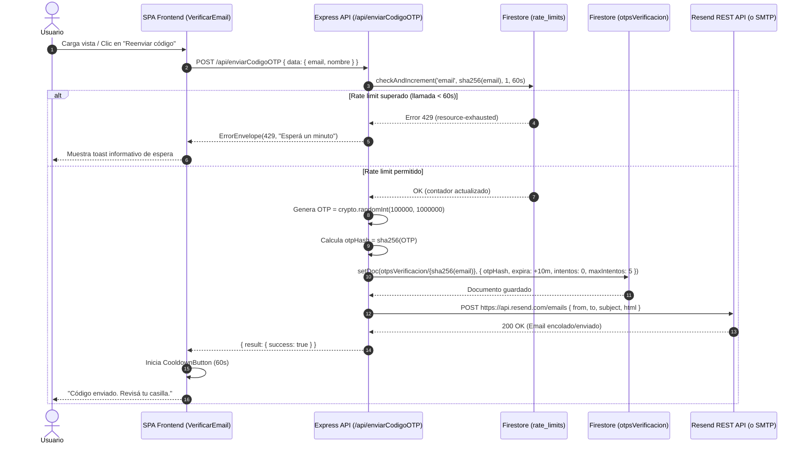
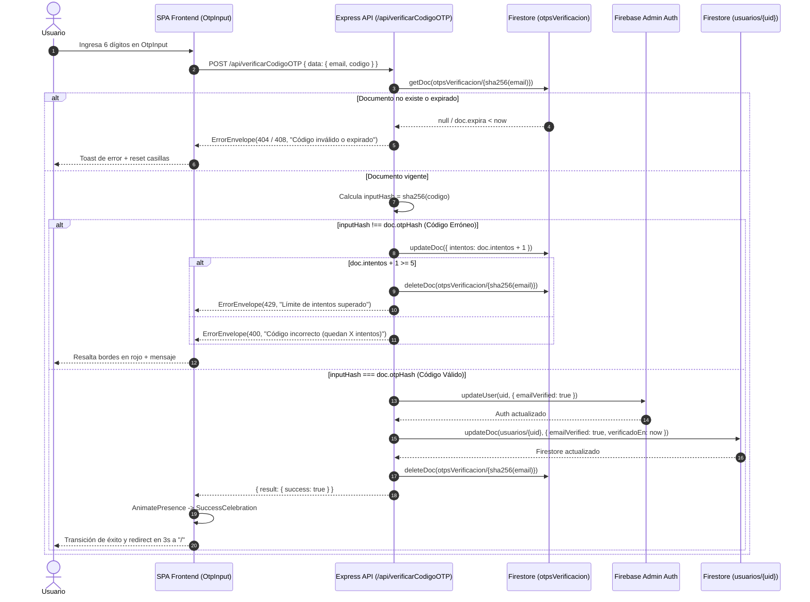

# Diseño Técnico: Verificación de Email por Código OTP de 6 Dígitos

**Identificador:** `verificacion-email-otp`  
**Fecha:** 2026-08-31  
**Autor:** Senior Architect  
**Estado:** Diseño aprobado para SDD  

---

## 1. Arquitectura del Sistema y Diagramas de Secuencia

### 1.1 Diagrama de Secuencia: Generación y Envío de Código OTP (`enviarCodigoOTP`)



### 1.2 Diagrama de Secuencia: Validación de Código OTP (`verificarCodigoOTP`)



---

## 2. Modelo de Datos y Esquemas de Base de Datos

### 2.1 Colección `otpsVerificacion` en Firestore
Cada documento almacena el estado criptográfico y de seguridad de un código OTP en vuelo. El ID del documento es el hash SHA-256 de la dirección de correo electrónico normalizada (`trim().toLowerCase()`).

```typescript
// ID: sha256(email.trim().toLowerCase())
export interface OtpVerificationDoc {
  email: string;        // Dirección de correo original (normalizada)
  nombre?: string;      // Nombre para personalización de plantilla
  otpHash: string;      // Hash SHA-256 del código numérico de 6 dígitos
  expira: number;       // Timestamp UNIX en ms (now + 10 minutos)
  intentos: number;     // Conteo de intentos fallidos acumulados (0 a 5)
  maxIntentos: number;  // Límite estricto de intentos permitidos (5)
  creado: number;       // Timestamp UNIX en ms de creación
}
```

### 2.2 Colección `rate_limits` en Firestore (Existente)
Mecanismo de throttling transaccional reutilizado:
- Documento: `rate_limits/email:{sha256(email)}`
- Esquema: `{ count: number, windowStart: number }`
- Ventana: 60,000 ms (1 minuto). Máximo: 1 petición.

---

## 3. Diseño de la Capa Backend

### 3.1 Módulo de Configuración (`api/src/config.ts`)
Se agregan los getters seguros para las nuevas variables de entorno:

```typescript
export function RESEND_API_KEY(): string {
  return process.env.RESEND_API_KEY || '';
}

export function EMAIL_FROM(): string {
  return process.env.EMAIL_FROM || 'StreamControl <soporte@streamcontrol.pro>';
}
```

### 3.2 Servicio de Email Híbrido (`api/src/email.ts`)

```typescript
interface SendEmailOptions {
  to: string;
  subject: string;
  html: string;
}

/**
 * Despachador de correos primario con cascada: Resend REST API -> Nodemailer SMTP -> Dev Console Mock
 */
export async function sendEmail({ to, subject, html }: SendEmailOptions): Promise<void> {
  const resendKey = RESEND_API_KEY();

  // 1. Prioridad: Resend REST API vía fetch nativo
  if (resendKey) {
    try {
      const response = await fetch('https://api.resend.com/emails', {
        method: 'POST',
        headers: {
          Authorization: `Bearer ${resendKey}`,
          'Content-Type': 'application/json',
        },
        body: JSON.stringify({
          from: EMAIL_FROM(),
          to: [to],
          subject,
          html,
        }),
      });

      if (!response.ok) {
        const errorBody = await response.text();
        console.error('❌ Resend API returned error:', response.status, errorBody);
        throw new Error(`Resend error status ${response.status}: ${errorBody}`);
      }

      console.log('✅ Email successfully sent via Resend API to', to);
      return;
    } catch (resendErr) {
      console.warn('⚠️ Resend dispatch failed, evaluating SMTP fallback...', resendErr);
      // Caída al siguiente nivel (SMTP)
    }
  }

  // 2. Fallback: Nodemailer SMTP
  const smtpUser = SMTP_USER();
  const smtpPass = SMTP_PASS();
  if (smtpUser && smtpPass) {
    try {
      await getTransporter().sendMail({
        from: `"StreamControl" <${smtpUser}>`,
        to,
        subject,
        html,
      });
      console.log('✅ Email successfully sent via SMTP to', to);
      return;
    } catch (smtpErr) {
      console.error('❌ SMTP fallback failed:', smtpErr);
      throw smtpErr;
    }
  }

  // 3. Fallback: Mock para desarrollo local
  console.log('\n========================================');
  console.log('✉️  [DEV MODE EMAIL]');
  console.log('To:', to);
  console.log('Subject:', subject);
  console.log('========================================\n');
}
```

### 3.3 Plantilla HTML para OTP (`buildOtpHtml`)

```typescript
function buildOtpHtml(userName: string, otpCode: string): string {
  return `
<!DOCTYPE html>
<html lang="es">
<head>
  <meta charset="UTF-8">
  <meta name="viewport" content="width=device-width, initial-scale=1.0">
  <style>
    body { margin: 0; padding: 0; background-color: #0f172a; font-family: -apple-system, BlinkMacSystemFont, 'Segoe UI', Roboto, Helvetica, Arial, sans-serif; }
    .container { max-width: 540px; margin: 0 auto; padding: 40px 20px; }
    .card { background: #1e293b; border-radius: 16px; padding: 40px 32px; border: 1px solid #334155; text-align: center; }
    .logo { color: #6366f1; font-size: 26px; font-weight: 800; letter-spacing: -0.5px; margin-bottom: 24px; }
    h2 { color: #f8fafc; font-size: 22px; font-weight: 700; margin: 0 0 12px 0; }
    p { color: #94a3b8; font-size: 15px; line-height: 1.6; margin: 0 0 24px 0; }
    .otp-box { background: #0f172a; border: 1px solid #4f46e5; border-radius: 12px; padding: 20px; margin: 24px 0; text-align: center; }
    .otp-code { font-family: 'Courier New', Courier, monospace; font-size: 38px; font-weight: 800; letter-spacing: 10px; color: #818cf8; margin-left: 10px; }
    .expiry { font-size: 13px; color: #cbd5e1; margin-top: 8px; }
    .security-note { background: #1e1b4b; border-radius: 8px; padding: 12px 16px; font-size: 13px; color: #a5b4fc; text-align: left; margin: 24px 0 0 0; }
    .footer { margin-top: 32px; text-align: center; font-size: 12px; color: #64748b; }
  </style>
</head>
<body>
  <div class="container">
    <div class="card">
      <div class="logo">StreamControl</div>
      <h2>Tu código de verificación</h2>
      <p>Hola <strong>${userName}</strong>, ingresá el siguiente código de 6 dígitos en la aplicación para activar tu cuenta:</p>
      <div class="otp-box">
        <div class="otp-code">${otpCode}</div>
        <div class="expiry">⏳ Válido por 10 minutos</div>
      </div>
      <div class="security-note">
        🔒 <strong>Seguridad:</strong> Nunca compartas este código con nadie. El equipo de StreamControl nunca te lo solicitará.
      </div>
    </div>
    <div class="footer">
      <p>StreamControl Pro — Plataforma de Gestión de Streaming</p>
      <p>¿No solicitaste este registro? Podés ignorar este correo con total tranquilidad.</p>
    </div>
  </div>
</body>
</html>`;
}
```

### 3.4 Módulo OTP Backend (`api/src/otpVerification.ts`)

```typescript
import * as crypto from 'crypto';
import type { AuthedReq } from './registry.js';
import { APIError } from './errors.js';
import { getDb, getAdmin } from './firebase.js';
import { sendOtpEmail } from './email.js';

const OTP_TTL_MS = 10 * 60 * 1000; // 10 minutos
const MAX_INTENTOS = 5;

export async function enviarCodigoOTP(req: AuthedReq): Promise<unknown> {
  const data = (req.data ?? {}) as Record<string, unknown>;
  const email = String(data.email ?? '').trim().toLowerCase();
  const nombre = String(data.nombre ?? '').trim() || 'Usuario';

  if (!email || !email.includes('@')) {
    throw new APIError('invalid-argument', 'Correo electrónico inválido');
  }

  const db = getDb();
  const emailHash = crypto.createHash('sha256').update(email).digest('hex');
  const otp = crypto.randomInt(100000, 1000000).toString();
  const otpHash = crypto.createHash('sha256').update(otp).digest('hex');
  const now = Date.now();

  const otpRef = db.collection('otpsVerificacion').doc(emailHash);
  await otpRef.set({
    email,
    nombre,
    otpHash,
    expira: now + OTP_TTL_MS,
    intentos: 0,
    maxIntentos: MAX_INTENTOS,
    creado: now,
  });

  await sendOtpEmail(email, nombre, otp);

  return { success: true, message: 'Código de verificación enviado' };
}

export async function verificarCodigoOTP(req: AuthedReq): Promise<unknown> {
  const data = (req.data ?? {}) as Record<string, unknown>;
  const email = String(data.email ?? '').trim().toLowerCase();
  const codigo = String(data.codigo ?? '').trim();

  if (!email || !codigo || codigo.length !== 6) {
    throw new APIError('invalid-argument', 'Email y código de 6 dígitos son requeridos');
  }

  const db = getDb();
  const emailHash = crypto.createHash('sha256').update(email).digest('hex');
  const otpRef = db.collection('otpsVerificacion').doc(emailHash);

  const otpDoc = await otpRef.get();
  if (!otpDoc.exists) {
    throw new APIError('not-found', 'No hay un código activo para este correo o ya expiró');
  }

  const otpData = otpDoc.data()!;
  const now = Date.now();

  if (now > otpData.expira) {
    await otpRef.delete();
    throw new APIError('deadline-exceeded', 'El código ha expirado. Solicitá uno nuevo.');
  }

  if (otpData.intentos >= otpData.maxIntentos) {
    await otpRef.delete();
    throw new APIError('resource-exhausted', 'Superaste el límite de intentos. Solicitá un nuevo código.');
  }

  const inputHash = crypto.createHash('sha256').update(codigo).digest('hex');
  if (inputHash !== otpData.otpHash) {
    const nuevosIntentos = otpData.intentos + 1;
    if (nuevosIntentos >= otpData.maxIntentos) {
      await otpRef.delete();
      throw new APIError('resource-exhausted', 'Código incorrecto. Superaste el límite de intentos.');
    } else {
      await otpRef.update({ intentos: nuevosIntentos });
      const restantes = otpData.maxIntentos - nuevosIntentos;
      throw new APIError('invalid-argument', `Código incorrecto. Te quedan ${restantes} intento${restantes === 1 ? '' : 's'}.`);
    }
  }

  // Código válido -> actualizar usuario y eliminar OTP
  let uid = req.auth?.uid;

  if (!uid) {
    const userSnap = await db.collection('usuarios').where('correo', '==', email).limit(1).get();
    if (!userSnap.empty) {
      uid = userSnap.docs[0].id;
    }
  }

  if (uid) {
    await db.collection('usuarios').doc(uid).update({
      emailVerified: true,
      verificadoEn: now,
    });

    try {
      const admin = getAdmin();
      await admin.auth().updateUser(uid, { emailVerified: true });
    } catch (authErr) {
      console.warn('⚠️ Admin Auth updateUser notice (Firestore updated successfully):', authErr);
    }
  }

  await otpRef.delete();

  return { success: true, message: 'Email verificado con éxito' };
}
```

---

## 4. Diseño de la Capa Frontend

### 4.1 Componente `OtpInput.tsx` (`src/components/Auth/OtpInput.tsx`)

```typescript
import React, { useRef, useEffect } from 'react';

interface OtpInputProps {
  length?: number;
  value: string;
  onChange: (value: string) => void;
  onComplete?: (value: string) => void;
  disabled?: boolean;
  hasError?: boolean;
}

export const OtpInput: React.FC<OtpInputProps> = ({
  length = 6,
  value,
  onChange,
  onComplete,
  disabled = false,
  hasError = false,
}) => {
  const inputRefs = useRef<(HTMLInputElement | null)[]>([]);

  // Array de dígitos individuales
  const digits = Array.from({ length }, (_, i) => value[i] || '');

  const handleChange = (index: number, char: string) => {
    if (disabled) return;
    const cleanChar = char.replace(/\D/g, '').slice(-1);
    const newDigits = [...digits];
    newDigits[index] = cleanChar;
    const newValue = newDigits.join('');
    onChange(newValue);

    if (cleanChar && index < length - 1) {
      inputRefs.current[index + 1]?.focus();
    }

    if (newValue.length === length && onComplete) {
      onComplete(newValue);
    }
  };

  const handleKeyDown = (index: number, e: React.KeyboardEvent<HTMLInputElement>) => {
    if (disabled) return;
    if (e.key === 'Backspace') {
      if (!digits[index] && index > 0) {
        inputRefs.current[index - 1]?.focus();
      }
    } else if (e.key === 'ArrowLeft' && index > 0) {
      inputRefs.current[index - 1]?.focus();
    } else if (e.key === 'ArrowRight' && index < length - 1) {
      inputRefs.current[index + 1]?.focus();
    }
  };

  const handlePaste = (e: React.ClipboardEvent) => {
    if (disabled) return;
    e.preventDefault();
    const pastedData = e.clipboardData.getData('text');
    const cleanNumbers = pastedData.replace(/\D/g, '').slice(0, length);
    if (!cleanNumbers) return;

    onChange(cleanNumbers);
    const nextFocusIndex = Math.min(cleanNumbers.length, length - 1);
    inputRefs.current[nextFocusIndex]?.focus();

    if (cleanNumbers.length === length && onComplete) {
      onComplete(cleanNumbers);
    }
  };

  return (
    <div className="flex items-center justify-center gap-2 sm:gap-3 my-4">
      {Array.from({ length }).map((_, index) => (
        <input
          key={index}
          ref={(el) => (inputRefs.current[index] = el)}
          type="text"
          inputMode="numeric"
          pattern="[0-9]*"
          autoComplete="one-time-code"
          maxLength={1}
          value={digits[index] || ''}
          onChange={(e) => handleChange(index, e.target.value)}
          onKeyDown={(e) => handleKeyDown(index, e)}
          onPaste={handlePaste}
          disabled={disabled}
          className={`w-11 h-13 sm:w-13 sm:h-16 text-center text-xl sm:text-2xl font-bold rounded-xl border bg-white/10 text-white placeholder-white/20 transition-all duration-200 outline-none
            ${hasError 
              ? 'border-red-500 bg-red-500/10 text-red-200 focus:ring-2 focus:ring-red-400' 
              : 'border-white/20 focus:border-indigo-400 focus:bg-white/20 focus:ring-2 focus:ring-indigo-400/50'
            }
            ${disabled ? 'opacity-50 cursor-not-allowed' : 'hover:border-white/40'}
          `}
        />
      ))}
    </div>
  );
};
```

### 4.2 Métodos en `AuthContext.tsx`

```typescript
const enviarCodigoOTP = async (overrideEmail?: string, overrideNombre?: string): Promise<void> => {
  const email = overrideEmail || auth.currentUser?.email || user?.correo;
  const nombre = overrideNombre || user?.nombre || 'Usuario';
  if (!email) throw new Error('No hay correo asociado a la sesión');
  await callFunction('enviarCodigoOTP', { email, nombre });
};

const verificarCodigo = async (codigo: string, overrideEmail?: string): Promise<void> => {
  const email = overrideEmail || auth.currentUser?.email || user?.correo;
  if (!email) throw new Error('No hay correo asociado a la sesión');
  await callFunction('verificarCodigoOTP', { email, codigo });
  // Actualizar estado reactivo local
  setUser(prev => prev ? { ...prev, emailVerified: true } as FirebaseUserWithData : null);
};
```

---

## 5. Consideraciones de Seguridad y Resiliencia

1. **Cero Almacenamiento en Texto Plano:** El OTP generado viaja por canal seguro TLS hacia el cliente de correo del usuario y solo su hash SHA-256 se persiste en Firestore.
2. **Defensa contra Ataques de Fuerza Bruta:** El espacio de búsqueda de 6 dígitos ($10^6$) queda totalmente blindado al limitar a 5 intentos fallidos máximos y destruir el documento ante cualquier intento fraudulento repetido.
3. **Control de Frecuencia (Rate Limiting):** El scope `email:{sha256(email)}` con ventana de 60s previene saturación de cuotas de correo y ataques de denegación de servicio (DoS) a buzones de usuarios.
4. **Idempotencia y Limpieza:** Los documentos de `otpsVerificacion` se limpian automáticamente tras el uso exitoso o al expirar, previniendo acumulación de registros en base de datos.
