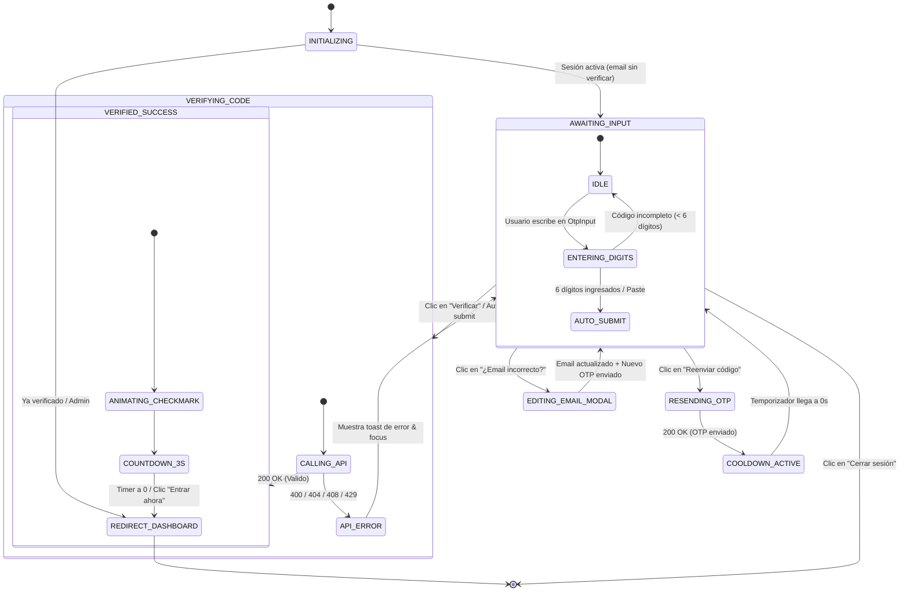

# Especificaciones: Verificación de Email por Código OTP de 6 Dígitos

**Identificador:** `verificacion-email-otp`  
**Fecha:** 2026-08-31  
**Autor:** Senior Architect  
**Estado:** Especificación aprobada para SDD  

---

## 1. Requerimientos Funcionales del Backend

### REQ-OTP-BE-001: Despacho Híbrido de Correos con Resend API y Fallbacks
- **Descripción:** El backend MUST proveer un servicio de email unificado y resiliente en `api/src/email.ts` con prioridad hacia Resend REST API.
- **Detalle Técnico:**
  - Si `RESEND_API_KEY` (o `process.env.RESEND_API_KEY`) está presente:
    - Realizar una petición HTTP `POST` nativa con `fetch` hacia `https://api.resend.com/emails`.
    - Headers: `Authorization: Bearer ${RESEND_API_KEY}`, `Content-Type: application/json`.
    - Payload: `{ from: EMAIL_FROM || "StreamControl <soporte@streamcontrol.pro>", to: [to], subject, html }`.
    - Si la respuesta HTTP no es `200` o `201`, capturar el error y activar el fallback a SMTP.
  - Si `RESEND_API_KEY` no está configurado (o falla):
    - Fallback a transporte SMTP (`nodemailer`) si `SMTP_USER` y `SMTP_PASS` están configurados.
  - Si ninguno está presente (entorno de desarrollo local):
    - Imprimir un bloque delimitado en consola (`[DEV MODE] Código OTP para {to}: {otp}`) sin arrojar excepciones de red.

### REQ-OTP-BE-002: Plantilla HTML Transaccional para Código OTP
- **Descripción:** El correo con el código de verificación MUST presentar un diseño claro, profesional y adaptado a móviles.
- **Detalle Técnico:**
  - Mostrar el isotipo/logo de StreamControl centrado.
  - Título: `¡Hola {nombre}! Tu código de verificación`.
  - Caja destacada con el código de 6 dígitos numéricos con tipografía monoespaciada o de gran tamaño (`font-size: 36px; font-weight: 700; letter-spacing: 8px; color: #1a73e8; background: #e8f0fe; padding: 20px; border-radius: 12px; text-align: center;`).
  - Leyenda de expiración explícita: `Este código expira en 10 minutos`.
  - Mensaje de seguridad: `Si no solicitaste este código, podés ignorar este correo de forma segura`.
  - Footer corporativo con datos de soporte.

### REQ-OTP-BE-003: Fix y Desacoplamiento en Trigger `onNuevoUsuario`
- **Descripción:** El trigger post-write `onNuevoUsuario` en `api/src/handlers.ts` MUST garantizar el envío del correo de bienvenida sin bloquear transacciones ni fallar silenciosamente.
- **Detalle Técnico:**
  - Mantener el reclamo transaccional `emailBienvenidaEnviado: true` en Firestore para evitar ejecuciones duplicadas concurrentes.
  - Ejecutar el despacho de `sendWelcomeEmail(correo, nombre)` de forma aislada en bloque `try/catch`.
  - Registrar logs informativos detallados (`✅ Welcome email sent` o `❌ Error sending welcome email`).

### REQ-OTP-BE-004: Endpoint `POST /api/enviarCodigoOTP`
- **Descripción:** Endpoint público (`auth: 'none'`) para generar y enviar un nuevo código OTP de 6 dígitos.
- **Detalle Técnico:**
  - **Validación de Entrada:** Payload `{ data: { email: string, nombre?: string } }`. El campo `email` es obligatorio y debe ser normalizado (`trim().toLowerCase()`).
  - **Rate Limiting:** Regla transaccional de 1 solicitud cada 60 segundos por email hasheado (`scope: 'email'`, `key: sha256(email)`, `max: 1`, `windowMs: 60_000`, `message: 'Esperá un minuto antes de solicitar otro código OTP'`).
  - **Generación Criptográfica:** El código de 6 dígitos MUST generarse mediante `crypto.randomInt(100000, 1000000).toString()`.
  - **Almacenamiento en Firestore:**
    - Colección: `otpsVerificacion`.
    - ID del Documento: `sha256(email)`.
    - Estructura:
      ```typescript
      {
        email: email,
        otpHash: crypto.createHash('sha256').update(otp).digest('hex'),
        expira: Date.now() + 10 * 60 * 1000, // 10 minutos
        intentos: 0,
        maxIntentos: 5,
        creado: Date.now()
      }
      ```
  - **Despacho:** Invocar `sendOtpEmail(email, nombre, otp)`.
  - **Respuesta:** `{ success: true, message: 'Código OTP enviado' }`.

### REQ-OTP-BE-005: Endpoint `POST /api/verificarCodigoOTP`
- **Descripción:** Endpoint público (`auth: 'none'`) para validar el código OTP ingresado por el usuario y confirmar su cuenta.
- **Detalle Técnico:**
  - **Validación de Entrada:** Payload `{ data: { email: string, codigo: string } }`.
  - **Búsqueda del Registro OTP:** Consultar el documento `otpsVerificacion/{sha256(email)}`.
    - Si no existe: arrojar `APIError('not-found', 'No hay un código activo para este correo o ya expiró.')`.
  - **Validación de Expiración:**
    - Si `Date.now() > doc.expira`: eliminar el documento y arrojar `APIError('deadline-exceeded', 'El código ha expirado. Solicitá uno nuevo.')`.
  - **Validación de Intentos y Fuerza Bruta:**
    - Si `doc.intentos >= doc.maxIntentos`: eliminar el documento y arrojar `APIError('resource-exhausted', 'Superaste el límite de intentos. Solicitá un nuevo código.')`.
  - **Comparación de Hash:**
    - Calcular `inputHash = sha256(codigo.trim())`.
    - Si `inputHash !== doc.otpHash`:
      - Incrementar atómicamente `intentos: doc.intentos + 1` en Firestore.
      - Si el nuevo valor alcanza `doc.maxIntentos`, eliminar el documento.
      - Arrojar `APIError('invalid-argument', 'Código incorrecto. Intentos restantes: ' + (doc.maxIntentos - (doc.intentos + 1)))`.
  - **Acciones en Caso de Éxito:**
    1. Localizar el UID del usuario: primero mediante token de sesión si `req.auth?.uid` existe, o buscando en Firestore `usuarios` donde `correo == email`, o consultando Firebase Admin `admin.auth().getUserByEmail(email)`.
    2. Actualizar Firebase Auth: `admin.auth().updateUser(uid, { emailVerified: true })`.
    3. Actualizar Firestore: `usuarios/{uid}` con `{ emailVerified: true, verificadoEn: Date.now() }`.
    4. Eliminar el documento `otpsVerificacion/{sha256(email)}`.
    5. Retornar `{ success: true, message: 'Email verificado con éxito' }`.

### REQ-OTP-BE-006: Registro de Rutas en `api/src/registry.ts`
- **Descripción:** Registrar `enviarCodigoOTP` y `verificarCodigoOTP` en `FN_REGISTRY` con sus políticas de rate limit correspondientes.

---

## 2. Requerimientos Funcionales del Frontend

### REQ-OTP-FE-001: Componente de Entrada de Dígitos `OtpInput.tsx`
- **Descripción:** Componente accesible y de alta usabilidad compuesto por 6 cajas individuales de entrada numérica.
- **Detalle Técnico:**
  - Renderizar exactamente 6 elementos `<input>`.
  - **Auto-Focus y Avance:** Al ingresar un dígito válido (0-9), almacenar el valor y enfocar inmediatamente la casilla siguiente (`index + 1`).
  - **Retroceso Inteligente (`Backspace`):** Si la casilla actual está vacía y se presiona `Backspace`, borrar el valor de la casilla anterior (`index - 1`) y enfocarla.
  - **Navegación por Teclado:** Soportar flechas izquierda (`ArrowLeft`) y derecha (`ArrowRight`) para alternar casillas.
  - **Soporte Completo de Pegado (`onPaste`):**
    - Al pegar un texto en cualquier casilla, extraer los primeros 6 caracteres numéricos (`clean = text.replace(/\D/g, '').slice(0, 6)`).
    - Distribuir los dígitos en las 6 casillas.
    - Si se completan los 6 dígitos, disparar automáticamente el callback `onComplete(cleanCode)`.
  - **Móvil Friendly:** Configurar atributos `type="text"`, `inputMode="numeric"`, `pattern="[0-9]*"`, `autoComplete="one-time-code"`.
  - **Estados Visuales:** Bordes activos con color de realce índigo/violeta, animación sutil de pulso al recibir foco y borde rojo ante error.

### REQ-OTP-FE-002: Pantalla Orquestadora `VerificarEmail.tsx`
- **Descripción:** Refactorización integral de la vista de verificación para centrarse en el ingreso del código OTP.
- **Detalle Técnico:**
  - Mostrar badge destinatario con la dirección a la que fue enviado el OTP.
  - Renderizar el componente `OtpInput`.
  - Botón primario "*Verificar código*" con estado de carga interactivo (`isSubmitting`).
  - Botón de reenvío con `CooldownButton` (temporizador regresivo de 60 segundos persistido en `sessionStorage`).
  - Enlace "*¿Te equivocaste de correo? Cambialo acá*" para abrir `CambiarEmailModal`.
  - Enlace de escape "*Cerrar sesión / Volver al login*".
  - Al validar exitosamente, transicionar mediante `AnimatePresence` al componente `SuccessCelebration` y redirigir tras 3 segundos a `/`.

### REQ-OTP-FE-003: Métodos en `AuthContext.tsx`
- **Descripción:** Exponer las funciones auxiliares para el envío y verificación de códigos OTP.
- **Detalle Técnico:**
  - `enviarCodigoOTP(email?: string, nombre?: string): Promise<void>`: invoca `callFunction('enviarCodigoOTP', { email, nombre })`.
  - `verificarCodigo(codigo: string, email?: string): Promise<void>`: invoca `callFunction('verificarCodigoOTP', { email, codigo })` y actualiza el estado local de `user.emailVerified = true`.

---

## 3. Máquina de Estados (State Machine)



---

## 4. Criterios de Aceptación (Gherkin Scenarios)

### Escenario 1: Envío y verificación exitosa de código OTP
```gherkin
Given un usuario autenticado con email "developer@streamcontrol.pro" y emailVerified en false
And el backend genera un código OTP "839201" válido por 10 minutos
When el usuario ingresa "839201" en el componente OtpInput
Then el frontend invoca automáticamente POST /api/verificarCodigoOTP
And el backend valida el hash SHA-256 satisfactoriamente
And Firebase Auth y Firestore marcan emailVerified en true
And el documento de OTP en Firestore es eliminado
And la pantalla de StreamControl muestra SuccessCelebration
And tras 3 segundos el usuario es redirigido al Dashboard "/"
```

### Escenario 2: Intento con código OTP incorrecto y decremento de intentos
```gherkin
Given un registro OTP con 0 intentos realizados y máximo 5
When el usuario ingresa el código incorrecto "111222"
Then el backend incrementa el contador de intentos a 1
And responde con un error indicando "Código incorrecto. Intentos restantes: 4"
And el frontend resalta los inputs de OtpInput en rojo y reproduce un toast de error
And el usuario mantiene su sesión en AWAITING_INPUT para reintentar
```

### Escenario 3: Bloqueo por superación del límite de 5 intentos fallidos
```gherkin
Given un registro OTP que ya acumula 4 intentos fallidos
When el usuario ingresa un quinto código erróneo "999999"
Then el backend elimina inmediatamente el documento de OTP
And responde con código HTTP 429 / resource-exhausted ("Superaste el límite de intentos")
And el frontend limpia los inputs y exige solicitar un nuevo código mediante el botón de reenvío
```

### Escenario 4: Código expirado (> 10 minutos)
```gherkin
Given un código OTP generado hace 11 minutos
When el usuario ingresa el código "839201"
Then el backend detecta Date.now() > expira
And elimina el documento expirado
And responde con código HTTP 408 / deadline-exceeded ("El código ha expirado")
And el frontend notifica al usuario que debe solicitar un código nuevo
```

### Escenario 5: Cooldown de 60 segundos en reenvío
```gherkin
Given un usuario en la pantalla de verificación que presiona "Reenviar código"
When la API confirma el envío
Then el botón cambia a estado deshabilitado con etiqueta "Reenviar código (60s)"
And el valor de cooldownUntil se persiste en sessionStorage
When el usuario recarga la página a los 35 segundos restantes
Then el botón permanece deshabilitado mostrando "Reenviar código (35s)"
```

### Escenario 6: Pegado de código desde portapapeles
```gherkin
Given el usuario tiene en su portapapeles el texto "Tu código de acceso es: 472918"
When el usuario presiona Ctrl+V / Cmd+V sobre la primera casilla de OtpInput
Then el componente extrae exclusivamente los dígitos "472918"
And rellena automáticamente las 6 casillas
And dispara el evento onComplete sin requerir pulsar botones adicionales
```

---

## 5. Matriz de Casos de Borde (Edge Cases)

| Caso de Borde | Comportamiento Esperado | Mitigación Técnica |
|---|---|---|
| **Pegado de texto con caracteres alfanuméricos ("SC-948123")** | Se filtran todos los caracteres no numéricos y se toman los primeros 6 dígitos. | `rawText.replace(/\D/g, '').slice(0, 6)` en el handler `onPaste`. |
| **Petición concurrente de validación (doble clic rápido)** | Se evita la doble ejecución en vuelo. | Flag `isSubmitting` en frontend y transacción atómica en Firestore backend. |
| **Permisos restringidos de Admin SDK en `getUserByEmail`** | Se debe actualizar Firestore primero y luego Firebase Auth de forma resiliente. | Fallback en cascada: resolver UID por token de sesión `req.auth.uid` → lookup en colección `usuarios` → `admin.auth().getUserByEmail`. |
| **Caída temporal o timeout de Resend API** | No dejar al usuario varado. Fallback automático a SMTP y registro de log de advertencia. | Bloque `try/catch` envolvente con fallback a `nodemailer` y mock en desarrollo local. |
| **Usuario escribe un nuevo código mientras hay cooldown activo** | El input permite escribir y validar en cualquier momento, el cooldown solo bloquea el reenvío de un nuevo correo. | Desacoplamiento entre el estado de `OtpInput` y el `CooldownButton`. |
